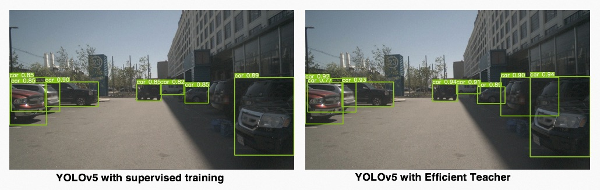

### Efficient Teacher
[English](README.md) | [简体中文](README.zh-CN.md)

[](https://paperswithcode.com/sota/semi-supervised-object-detection-on-coco-10?p=efficient-teacher-semi-supervised-object)
[](https://paperswithcode.com/sota/semi-supervised-object-detection-on-coco-2?p=efficient-teacher-semi-supervised-object)
[](https://paperswithcode.com/sota/semi-supervised-object-detection-on-coco-5?p=efficient-teacher-semi-supervised-object)
[](https://paperswithcode.com/sota/semi-supervised-object-detection-on-coco-1?p=efficient-teacher-semi-supervised-object)

 ** [2023/03/14: We release pre-trained YOLOv5l on object365 and transfer learning recipe]**
 * [**YOLOv5l on object365**](https://github.com/AlibabaResearch/efficientteacher/releases/download/1.0/efficient-yolov5-object365.pt)
 * [**Crack your training task in 30 epochs**](https://github.com/AlibabaResearch/efficientteacher/wiki/Crack-your-training-task-with-semi-supervised-transfer-learning)

Efficient Teacher is created by the Alibaba and used for tuning of both supervised and semi-supervised object detection(SSOD) algorithms.For more details, please refer to our [paper](https://arxiv.org/abs/2302.07577).

Based on the YOLOv5 open source project, Efficient Teacher uses YACS and the latest network design to restructure key modules, so that it can achieve supervised and semi-supervised training for YOLOv5, YOLOX, YOLOv6, YOLOv7, and YOLOv8 using a single algorithm library.


### Why Efficient Teacher
<!--  -->



If you encounter difficulties due to domain differences between training data and actual deployment scenarios, high cost of business scenario data reflux, and high cost of labeling specific categories:
- Efficient Teacher introduces semi-supervised object detection into practical applications, enabling users to **obtain a strong generalization capability with only a small amount of labeled data and large amount of unlabeled data**.
- Efficient Teacher provides category and custom uniform sampling, which can quickly improve the network performance in actual business scenarios.

<!-- If you are a heavy user of YOLOv5: -->
If you are already familiar with the YOLOv5 open-source framework and have your own modified algorithm library (which is quite common in the development process of an applied algorithms engineer):

- You can use the ```convert_pt_to_efficient.py``` script to convert YOLOv5 weights to Efficient weights
- You can use the existing datasets and annotations tailored specifically for YOLOv5 without any format adjustment
- With a simple modification of the YAML configuration file, you can convert the training network from **YOLOv5** to **YOLOX/YOLOv6/YOLOv7/YOLOv8** with the same verification indicators as YOLOv5, making it easier to understand whether the new network structure is really effective for your task.

Below are the results of the YOLOv5l trained using Efficient Teacher. We did not make any modicications to the YOLOv5l structure, but instead designed some training modules to help the network generate pseudo-labels for unlabeled data and learn effective information from these pseudo-labels. Efficient Teacher can improve the mAP<sup>val</sup> of standard YOLOv5l from 49.00 to **50.45** using unlabeled data on the COCO dataset.

### MS-COCO SSOD additional
|Model |Dataset|size<br><sup>(pixels)|mAP<sup>val<br>0.5:0.95 |Speed<br><sup>V100<br>Pytorch<br>b32<br>FP32<br>(ms)|params<br><sup>(M) |FLOPs<br><sup>@640 (G)
|---  |---    |---                  |---  |---    |---    |---   
|[**YOLOv5s<br>Supervised**](https://github.com/AlibabaResearch/efficientteacher/releases/download/1.0/efficient-yolov5s.pt)|train2017|640 | 37.2  |1.6	| 7.2	| 16.5
|[**YOLOv5s<br>Efficient Teacher**](https://github.com/AlibabaResearch/efficientteacher/releases/download/1.0/efficient-yolov5s-ssod.pt)   |train2017 + unlabeled2017|640 | **38.1(+0.9)**  |1.6    |7.2    |16.5
|[**YOLOv5m<br>Supervised**](https://github.com/AlibabaResearch/efficientteacher/releases/download/1.0/efficient-yolov5m.pt)|train2017|640|45.4|4.8|21.17|48.97
|[**YOLOv5m<br>Efficient Teacher**](https://github.com/AlibabaResearch/efficientteacher/releases/download/1.0/efficient-yolov5m-ssod.pt)   |train2017 + unlabeled2017|640 | **46.4(+1.0)**  |4.8    |21.17   |48.97
|[**YOLOv5l<br>Supervised**](https://github.com/AlibabaResearch/efficientteacher/releases/download/1.0/efficient-yolov5l.pt)|train2017|640 | 49.00  |6.2    |46.56    |109.59
|[**YOLOv5l<br>Efficient Teacher**](https://github.com/AlibabaResearch/efficientteacher/releases/download/1.0/efficient-yolov5l-ssod.pt)   |train2017 + unlabeled2017|640 | **50.45(+1.45)**  |6.2    |46.56    |109.59
  
### MS-COCO SSOD standard
|Model |Dataset|size<br><sup>(pixels)|mAP<sup>val<br>0.5:0.95 |Speed<br><sup>V100<br>Pytorch<br>b32<br>FP32<br>(ms)|params<br><sup>(M) |FLOPs<br><sup>@640 (G)
|---  |---    |---                  |---  |---    |---    |---   
|YOLOv5l<br>Supervised|1% labeled|640 | 9.91  |6.2    |46.56    |109.59
|YOLOv5l<br>Efficient Teacher   |1% labeled|640 | **23.8**  |6.2    |46.56    |109.59
|YOLOv5l<br>Supervised|2% labeled|640 | 14.01  |6.2    |46.56    |109.59
|YOLOv5l<br>Efficient Teacher|2% labeled|640 | **28.7**  |6.2    |46.56    |109.59
|YOLOv5l<br>Supervised|5% labeled|640 | 23.75  |6.2    |46.56    |109.59
|YOLOv5l<br>Efficient Teacher|5% labeled|640 | **34.1**  |6.2    |46.56    |109.59
|YOLOv5l<br>Supervised|10% labeled|640 | 28.45  |6.2    |46.56    |109.59
|YOLOv5l<br>Efficient Teacher|10% labeled|640 | **37.9**  |6.2    |46.56    |109.59

We also provide variouss solutions implemented with supervised training. Below are the performance results of various detectors trained using the current library.

### MS-COCO
|Model |size<br><sup>(pixels) |mAP<sup>val<br>0.5:0.95 |mAP<sup>val<br>0.5 |Precision<br><sup><br> |Recall<br><sup><br>|Speed<br><sup>V100<br>Pytorch<br>b32<br>FP32<br>(ms) |params<br><sup>(M) |FLOPs<br><sup>@640 (G)
|---                    |---  |---    |---    |---    |---    |---    |---    |---
|Nanodetm      |320  |20.2   |33.4   |47.8     |33.7    |0.6    |0.9593    | 0.730
|[**YOLOv5n**]((https://github.com/AlibabaResearch/efficientteacher/releases/download/1.0/efficient-yolov5n.pt))      |320  |20.5   |34.6   |49.8     |33.3    |0.4    |1.87    | 1.12
|YOLOXn  |320  |24.2   |38.4   |55.7     |36.5   |0.5    |2.02    | 1.39
|YOLOv6n |640  |34.4   |49.3   |61.1     |45.8    |0.9   |4.34    |11.26
|[**YOLOv5s**](https://github.com/AlibabaResearch/efficientteacher/releases/download/1.0/efficient-yolov5s.pt)      |640  |37.2   |56.8   |68.1     |50.9    |1.6    |7.2    |16.5
|YOLOXs      |640  |39.7   |59.6   |65.2     |56.0    |1.7    |8.04    |21.42
|YOLOv6t |640  |40.3   |56.5   |68.9     |50.5    |1.7    |9.72    |25.11
|YOLOv6s |640  |42.1   |58.6   |69.1     |52.5    |1.9    |17.22    |44.25
|YOLOv7s |640  |43.1   |60.1   |69.6     |55.3    |2.3    |8.66    |23.69
|[**YOLOv7s SimOTA**](https://github.com/AlibabaResearch/efficientteacher/releases/download/1.0/efficient-yolov7s-simota.pt)      |640  |44.5   |62.5   |71.8     |56.5    |2.4    |9.47    |28.48
|[**YOLOv5m**](https://github.com/AlibabaResearch/efficientteacher/releases/download/1.0/efficient-yolov5m.pt) | 640|45.4|64.1|72.4|57.6|4.8|21.17|48.97
|[**YOLOv5l**](https://github.com/AlibabaResearch/efficientteacher/releases/download/1.0/efficient-yolov5l.pt)      |640  |49.0   |66.1   |74.2     |61    |6.2    |46.56    |109.59
|[**YOLOv5x**](https://github.com/AlibabaResearch/efficientteacher/releases/download/1.0/efficient-yolov5x.pt)      |640  |50.7   |68.8   |74.2     |62.6    |10.7    |86.71    |205.67
|[**YOLOv7**](https://github.com/AlibabaResearch/efficientteacher/releases/download/1.0/efficient-yolov7.pt)      |640  |51.5   |69.1   |72.6     |63.5    |6.8    |37.62    |106.47


### Reproduce the COCO SSOD experimental results.
- First, you need to download the images and labels of the COCO dataset and process them into the default format of YOLOv5 (which should be familiar to you).
  ```
  bash data/get_coco.sh
  ```
- Organize downloaded pictures and annotation files in the following format.
  ```
  efficientteacher
    ├── data
    └── datasets
        └── coco  ← downloads here (20.1 GB)
             └── images
             └── labels
  ```
- download train/val dataset list:
  ```
  bash data/get_label.sh
  ```
- replace the "local_path" with your local path of the EfficientTeacher folder.
  ```
  CUR_PATH=$(pwd)
  sed -i "s#local_path#$CUR_PATH#" data/coco/train2017*.txt
  sed -i "s#local_path#$CUR_PATH#" data/coco/val2017.txt
  ```
- If you don't have your own GPU open container environment, we recommend using the official container environment of Modelscope. We have verified all training and inference code in this environment.
  ```
  docker run registry.cn-hangzhou.aliyuncs.com/modelscope-repo/modelscope:ubuntu20.04-cuda11.3.0-py37-torch1.11.0-tf1.15.5-1.3.0
  ```


- COCO 10% labeled SSOD training
  ```
  export CUDA_VISIBLE_DEVICES="0,1,2,3,4,5,6,7"
  python -m torch.distributed.launch --nproc_per_node 8 --master_addr 127.0.0.2 --master_port 29502 train.py --cfg configs/ssod/coco-standard/yolov5l_coco_ssod_10_percent.yaml 
  ```

### Using Efficient Teacher in Your Project!
<details>
<summary>From supervised to SSOD Training</summary>

Before we proceed with semi-supervised training, we need you to convert your own model trained with the YOLOv5 open source framework into a format that we can recognize. If you are using version 6.0 or later, the process is very fast and can be completed in five minutes: 

1. Convert Model
- First, you need to write a yaml file. You can directly modify the file ```configs/custom/yolov5l_custom.yaml```. If your model is yolov5l, then you only need to modify the nc in Dataset to the number of your detection classes and then modify the names. If your model is other depth and width configurations, then modify the depth_multiple and width_multiple to the corresponding configurations. 
- After having this yaml file, go to the scripts folder to modify the ```convert_pt_to_efficient.py```, fill in your business model pt, yaml, and the exported pt file.
- OK, you have already converted your pt file into a version that our algorithm library can recognize. Don't worry, if you need to export the model to onnx or export it back to your own YOLOv5 algorithm library, we also provide corresponding scripts.

2. Validation 

- This step is to verify that the converted model still maintains the corresponding accuracy and recall on your validation set, so we hope you use the following script to verify the current model again, so that you also have a semi-supervised object detection baseline, in order to confirm that Efficient Teacher really works on your dataset.

- modify the ```val: data/custom_val.txt``` in ```yolov5l_custom.yaml``` into your own validation set path, then run the following code: 
  ```
  python val.py --cfg configs/sup/custom/yolov5l_custom.yaml --weights efficient-yolov5l.pt 
  ```
- if you modify the file read path, you will need to add the corresponding modifications in the utils/dataloader.py file, just like you did when you modified the code for YOLOv5.

3. Supervised Training(Optional)
- modify the ```train: data/custom_train.txt``` in ```yolov5l_custom.yaml```, and then enter the following script.
   ```
   export CUDA_VISIBLE_DEVICES="0,1,2,3,4,5,6,7"
   python -m torch.distributed.launch --nproc_per_node 8 --master_addr 127.0.0.2 --master_port 29502 train.py --cfg configs/sup/custom/yolov5l_custom.yaml 
   ```

4. SSOD Training
- modify the ```train: data/custom_train.txt``` in ```yolov5l_custom.yaml```, creat an unlabeled data image list using following command:
  ```
  find <unlabel_path> -name "*.jpg" >> unlabel.txt
  ```
- change the ```target: data_custom_target.txt```  to ```target:unlabel.txt``` in ```yolov5l_custom.yaml```, and psate the following config into ```yolov5l_custom.yaml```:
  ```
  SSOD:
    train_domain: True
    nms_conf_thres: 0.1
    nms_iou_thres: 0.65
    teacher_loss_weight: 1.0
    cls_loss_weight: 0.3
    box_loss_weight: 0.05
    obj_loss_weight: 0.7
    loss_type: 'ComputeStudentMatchLoss'
    ignore_thres_low: 0.1
    ignore_thres_high: 0.6
    uncertain_aug: True
    use_ota: False
    multi_label: False
    ignore_obj: False
    pseudo_label_with_obj: True
    pseudo_label_with_bbox: True
    pseudo_label_with_cls: False
    with_da_loss: False
    da_loss_weights: 0.01
    epoch_adaptor: True
    resample_high_percent: 0.25
    resample_low_percent: 0.99
    ema_rate: 0.999
    cosine_ema: True
    imitate_teacher: False
    ssod_hyp:
      with_gt: False
      mosaic: 1.0
      cutout: 0.5
      autoaugment: 0.5
      scale: 0.8
      degrees: 0.0
      shear: 0.0
  ```
- you have now completed a re-write yaml file for a SSOD training, enter the following script:
   ```
   export CUDA_VISIBLE_DEVICES="0,1,2,3,4,5,6,7"
   python -m torch.distributed.launch --nproc_per_node 8 --master_addr 127.0.0.2 --master_port 29502 train.py --cfg configs/sup/custom/yolov5l_custom.yaml 
   ```

</details>

<details>
<summary>Start SSOD Training derectly</summary>
We have verified the Efficient Teacher in many actual projects, so we do not recommend directly starting semi-supervised object detection, since the score threshold for generating pseudo labels and the NMS threshold are directly related to the detection task. The COCO version hyper-parameters provided by us may not necessarily be suitable for your specific project. For example, if you are conducting single-class detection, then we suggest that the NMS threshold during pseudo label generation be reduced as much as possible, so that a large number of overlapping pseudo labels will not be generated.

1. Edit your semi-supervised training task according to ```configs/ssod/custom/yolov5l_custom_ssod.yaml```, where the ```train/val/test``` in the Dataset should be filled in according to your project's original txt, and the target needs you to index an unlabeled dataset that you expect. We suggest using the images of the COCO train dataset, and a unlabeled dataset can be generated by entering ```"find img_dir -name "*.jpg" >> target_img.txt"```.

2. rewrite ```nc``` and ```names``` in yaml according to your individual tasks.
3. train SSOD model from scratch, the default setting is to first conduct a 220-epoch burn-in training, and then enter the SSOD training, which has been introduced in our paper.
   ```
   export CUDA_VISIBLE_DEVICES="0,1,2,3,4,5,6,7"
   python -m torch.distributed.launch --nproc_per_node 8 --master_addr 127.0.0.2 --master_port 29502 train.py --cfg configs/ssod/custom/yolov5l_custom_ssod.yaml 
   ```

4. validation SSOD model
   ```
   python val.py --cfg configs/ssod/custom/yolov5l_custom_ssod.yaml --weights ssod-yolov5l.pt  --val-ssod
   ```

</details>


### Citing Efficient Teacher
```
@article{xu2023efficient,
  title={Efficient Teacher: Semi-Supervised Object Detection for YOLOv5},
  author={Xu, Bowen and Chen, Mingtao and Guan, Wenlong and Hu, Lulu},
  journal={arXiv preprint arXiv:2302.07577},
  year={2023}
}
```

### Reference
 efficientteacher is developed by Alibaba and based on the yolov5 program.  Code is distributed under the GPL3.0.
 This product contains various third-party components under other open source licenses. See the NOTICE file for more information.
1. https://github.com/facebookresearch/detectron2
2. https://github.com/Megvii-BaseDetection/YOLOX
3. https://github.com/ultralytics/yolov5
4. https://github.com/open-mmlab/mmdetection
5. https://github.com/Bobo-y/flexible-yolov5
6. https://github.com/Nioolek/PPYOLOE_pytorch
7. https://github.com/meituan/YOLOv6
8. https://github.com/ultralytics/ultralytics
