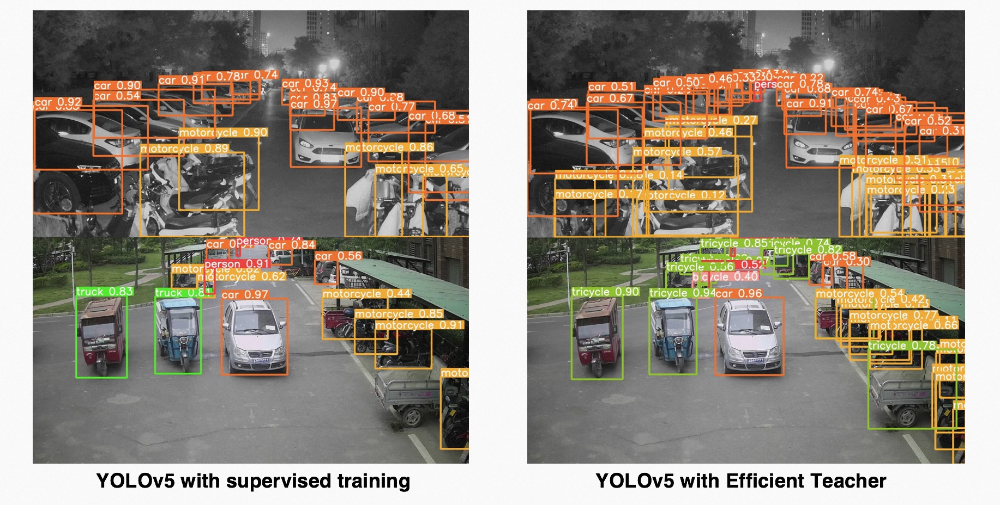
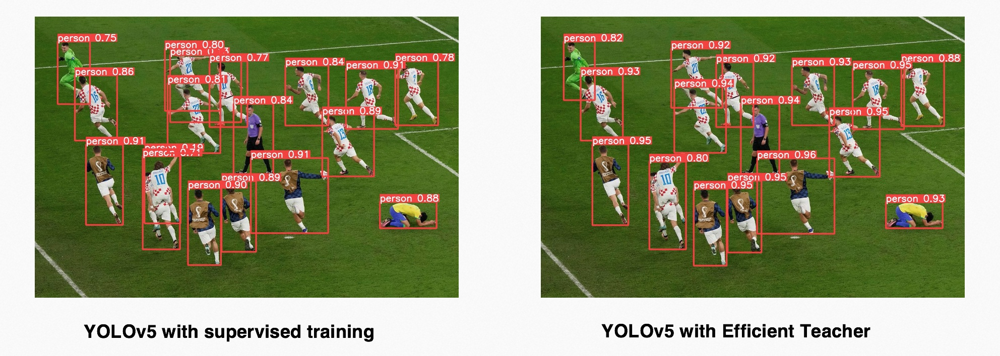
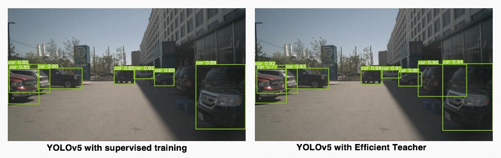

### Efficient Teacher
[](https://paperswithcode.com/sota/semi-supervised-object-detection-on-coco-10?p=efficient-teacher-semi-supervised-object)
[](https://paperswithcode.com/sota/semi-supervised-object-detection-on-coco-2?p=efficient-teacher-semi-supervised-object)
[](https://paperswithcode.com/sota/semi-supervised-object-detection-on-coco-5?p=efficient-teacher-semi-supervised-object)
[](https://paperswithcode.com/sota/semi-supervised-object-detection-on-coco-1?p=efficient-teacher-semi-supervised-object)

 ** [2023/03/14: 我们开源了在object365上预训练的YOLOv5l权重来帮助您快速尝试使用Efficient Teacher来破解您的训练任务]**
 * [**YOLOv5l on object365**](https://github.com/AlibabaResearch/efficientteacher/releases/download/1.0/efficient-yolov5-object365.pt)
 * [**Crack your training task in 30 epochs**](https://github.com/AlibabaResearch/efficientteacher/wiki/Crack-your-training-task-with-semi-supervised-transfer-learning)

Efficient Teacher是由阿里巴巴推出的用于研究针对YOLOv5的半监督目标检测算法(semi-supervised object detction)，对于技术设计方案感兴趣的朋友可以查看我们的[论文](https://arxiv.org/abs/2302.07577).

我们开源出来的算法库是根据YOLOv5官方实现添加YACS进行重构的，当前的算法库可以完成YOLOv5的有监督和半监督训练，同时也能进行YOLOX/YOLOv6/YOLOv7/YOLOv8的有监督训练，所有的检测器训练后使用同样的参数进行验证，可以方便大家对比在同一个任务上采用不用的检测器带来的收益。

Efficient Teacher算法的使用场景



如果您发现遇到了以下情况时，我们推荐您尝试Efficient Teacher：
- 训练时的数据和模型实际部署场景差异较大，现场算法常出现漏检和误检
- 模型部署现场的图片数据回传成本大，仅能获得很少量的现场数据
- 大量回传的现场图片标注成本高，大量检测任务并行开发且客制化程度高，无法相互复用

我们的Efficient Teacher将会采用半监督训练的方式来帮助您利用少部分的标注数据和大量的无标注数据来训练出一个具有较好泛化性能的检测器，提升模型在实际场景的表现。同时我们还提供了两套均匀采样的训练数据读取方案，可以让检测器在训练时尽量多地去拟合在您指定的数据分布。

如果您已经非常熟悉YOLOv5开源库的使用方法，甚至您自己就保有一份针对业务进行修改的YOLOv5算法库，我们提供了```convert_pt_to_efficient.py```脚本，让您可以轻松地把您已经训练出来的YOLOv5模型转换成我们定义的格式，如果您使用的是YOLOv5 6.0版本以上的库，那么整个过程将会非常快，如果您在转换过程中遇到任何问题，请留下issue，我们将会解决您的格式转换问题，同样地，在Efficient Teacher训练完后，您也可以将模型再转回到YOLOv5格式，方便您继续在原有的工作流来验证模型。
除此之外，当您已经熟悉了我们的YAML编写规则，那么您也可以通过简单修改几行配置文件，将您的训练模型从YOLOv5迁移到YOLOX/YOLOv6/YOLOv7/YOLOv8，这些训练出来的模型运行的是同样的验证代码，所以您可以很轻易地判断出来新的网络结构是否适合您当前的检测任务。


下面是我们利用efficientteacher库使用半监督训练出来的YOLOv5l检测器的效果，我们没有对YOLOv5l结构做任何修改，仅仅是设计了一些训练模块来帮助网络针对没有标签的数据生成伪标签并从伪标签中学到真正有效的信息，Efficient Teacher可以在COCO数据集上实现利用unlabeled数据集将标准YOLOv5l的mAP从49.00提升到50.45。

### MS-COCO SSOD additional
|Model |Dataset|size<br><sup>(pixels)|mAP<sup>val<br>0.5:0.95 |Speed<br><sup>V100<br>Pytorch<br>b32<br>FP32<br>(ms)|params<br><sup>(M) |FLOPs<br><sup>@640 (G)
|---  |---    |---                  |---  |---    |---    |---   
|[**YOLOv5s<br>Supervised**](https://github.com/AlibabaResearch/efficientteacher/releases/download/1.0/efficient-yolov5s.pt)|train2017|640 | 37.2  |1.6	| 7.2	| 16.5
|[**YOLOv5s<br>Efficient Teacher**](https://github.com/AlibabaResearch/efficientteacher/releases/download/1.0/efficient-yolov5s-ssod.pt)   |train2017 + unlabeled2017|640 | **38.1(+0.9)**  |1.6    |7.2    |16.5
|[**YOLOv5m<br>Supervised**](https://github.com/AlibabaResearch/efficientteacher/releases/download/1.0/efficient-yolov5m.pt)|train2017|640|45.4|4.8|21.17|48.97
|[**YOLOv5m<br>Efficient Teacher**](https://github.com/AlibabaResearch/efficientteacher/releases/download/1.0/efficient-yolov5m-ssod.pt)   |train2017 + unlabeled2017|640 | **46.4(+1.0)**  |4.8    |21.17   |48.97
|[**YOLOv5l<br>Supervised**](https://github.com/AlibabaResearch/efficientteacher/releases/download/1.0/efficient-yolov5l.pt)|train2017|640 | 49.00  |6.2    |46.56    |109.59
|[**YOLOv5l<br>Efficient Teacher**](https://github.com/AlibabaResearch/efficientteacher/releases/download/1.0/efficient-yolov5l-ssod.pt)   |train2017 + unlabeled2017|640 | **50.45(+1.45)**  |6.2    |46.56    |109.59

### MS-COCO SSOD
|Model |Dataset|size<br><sup>(pixels)|mAP<sup>val<br>0.5:0.95 |Speed<br><sup>V100<br>Pytorch<br>b32<br>FP32<br>(ms)|params<br><sup>(M) |FLOPs<br><sup>@640 (G)
|---  |---    |---                  |---  |---    |---    |---   
|YOLOv5l<br>Supervised|1% labeled|640 | 9.91  |6.2    |46.56    |109.59
|YOLOv5l<br>Efficient Teacher   |1% labeled|640 | **23.8**  |6.2    |46.56    |109.59
|YOLOv5l<br>Supervised|2% labeled|640 | 14.01  |6.2    |46.56    |109.59
|YOLOv5l<br>Efficient Teacher|2% labeled|640 | **28.7**  |6.2    |46.56    |109.59
|YOLOv5l<br>Supervised|5% labeled|640 | 23.75  |6.2    |46.56    |109.59
|YOLOv5l<br>Efficient Teacher|5% labeled|640 | **34.1**  |6.2    |46.56    |109.59
|YOLOv5l<br>Supervised|10% labeled|640 | 28.45  |6.2    |46.56    |109.59
|YOLOv5l<br>Efficient Teacher|10% labeled|640 | **37.9**  |6.2    |46.56    |109.59

下面是一些我们用Efficient Teacher库训练出来的网络结果，它们都遵从同样的准确率计算代码和计算量统计代码，能够帮助您在方案选型时有一个基本的判断。
### MS-COCO
|Model |size<br><sup>(pixels) |mAP<sup>val<br>0.5:0.95 |mAP<sup>val<br>0.5 |Precision<br><sup><br> |Recall<br><sup><br>|Speed<br><sup>V100<br>Pytorch<br>b32<br>FP32<br>(ms) |params<br><sup>(M) |FLOPs<br><sup>@640 (G)
|---                    |---  |---    |---    |---    |---    |---    |---    |---
|Nanodetm      |320  |20.2   |33.4   |47.8     |33.7    |0.6    |0.9593    | 0.730
|[**YOLOv5n**]((https://github.com/AlibabaResearch/efficientteacher/releases/download/1.0/efficient-yolov5n.pt))      |320  |20.5   |34.6   |49.8     |33.3    |0.4    |1.87    | 1.12
|YOLOXn  |320  |24.2   |38.4   |55.7     |36.5   |0.5    |2.02    | 1.39
|YOLOv6n |640  |34.4   |49.3   |61.1     |45.8    |0.9   |4.34    |11.26
|[**YOLOv5s**](https://github.com/AlibabaResearch/efficientteacher/releases/download/1.0/efficient-yolov5s.pt)      |640  |37.4   |56.8   |68.1     |50.9    |1.6    |7.2    |16.5
|YOLOXs      |640  |39.7   |59.6   |65.2     |56.0    |1.7    |8.04    |21.42
|YOLOv6t |640  |40.3   |56.5   |68.9     |50.5    |1.7    |9.72    |25.11
|YOLOv6s |640  |42.1   |58.6   |69.1     |52.5    |1.9    |17.22    |44.25
|YOLOv7s |640  |43.1   |60.1   |69.6     |55.3    |2.3    |8.66    |23.69
|[**YOLOv7s SimOTA**](https://github.com/AlibabaResearch/efficientteacher/releases/download/1.0/efficient-yolov7s-simota.pt)      |640  |44.5   |62.5   |71.8     |56.5    |2.4    |9.47    |28.48
|[**YOLOv5m**](https://github.com/AlibabaResearch/efficientteacher/releases/download/1.0/efficient-yolov5m.pt) | 640|45.4|64.1|72.4|57.6|4.8|21.17|48.97
|[**YOLOv5l**](https://github.com/AlibabaResearch/efficientteacher/releases/download/1.0/efficient-yolov5l.pt)      |640  |49.0   |66.1   |74.2     |61    |6.2    |46.56    |109.59
|[**YOLOv5x**](https://github.com/AlibabaResearch/efficientteacher/releases/download/1.0/efficient-yolov5x.pt)      |640  |50.7   |68.8   |74.2     |62.6    |10.7    |86.71    |205.67
|[**YOLOv7**](https://github.com/AlibabaResearch/efficientteacher/releases/download/1.0/efficient-yolov7.pt)      |640  |51.5   |69.1   |72.6     |63.5    |6.8    |37.62    |106.47

### 复现我们的COCO半监督训练实验
- 首先，请您下载YOLOv5提供的COCO数据集，他们已经帮您处理好标签格式，这会为您复现代码节约大量的时间
  ```
  bash data/get_coco.sh
  ```
- 请将下载好的数据按照如下文件夹格式进行组织：
  ```
  efficientteacher
    ├── data
    └── datasets
        └── coco  ← downloads here (20.1 GB)
             └── images
             └── labels
  ```
- 下载训练集和验证集的图片列表：
  ```
  bash data/get_label.sh
  ```
- 将图片列表中的 "local_path" 修改成您自己的当前放置efficientteacher代码的folder.
  ```
  CUR_PATH=$(pwd)
  sed -i "s#local_path#$CUR_PATH#" data/coco/train2017*.txt
  sed -i "s#local_path#$CUR_PATH#" data/coco/val2017.txt
  ```
- 如果您的训练GPU没有驱动的特殊限制，我们推荐您直接使用达摩院提供的容器，这是我们训练和验证模型使用的默认容器，这样能规避大量的三方库版本冲突问题：
  ```
  docker run registry.cn-hangzhou.aliyuncs.com/modelscope-repo/modelscope:ubuntu20.04-cuda11.3.0-py37-torch1.11.0-tf1.15.5-1.3.0
  ```
- 启动10%标注训练，我们默认使用的是8卡V100机器，请您按照您的实际训练GPU个数修改CUDA_VISBLE_DEVICES的索引号以及nproc_per_node的数值
  ```
  export CUDA_VISIBLE_DEVICES="0,1,2,3,4,5,6,7"
  python -m torch.distributed.launch --nproc_per_node 8 --master_addr 127.0.0.2 --master_port 29502 train.py --cfg configs/ssod/coco-standard/yolov5l_coco_ssod_10_percent.yaml 
  ```

### 在实际项目中使用Efficient Teacher方案
<details>
<summary>从有监督过渡到半监督方案</summary>

感谢您选择这种稳健的方案来验证半监督训练的效果，这个方案步骤稍微多一些，但是每一步都是有基准线的，请按照以下步骤开始您的旅程：
1. 模型转换
- 首先请您查看一下```configs/custom/yolov5_custom.yaml```这份文件，如果您的模型是YOLOv5l, 那么你只需要修改yaml文件中Dataset里的nc参数，再修改一些类别名。如果您的模型结构是n/m/s/x，那么您还需要针对性地修改depth_multiple和width_multiple这两个参数
- 接着请您来到scripts文件夹下面修改```convert_pt_to_efficient.py```这份文件，填上您使用标准或魔改的YOLOv5代码训练出的模型pt, 再填上你修改后的yolov5_custom.yaml的绝对路径，还有你希望导出的模型放置位置
- 如果上述操作没有报错的话，您现在已经获得了一份可以在efficientteacher库中运行的模型了，不用担心，我们的代码库也提供导回您自己算法库和导出为onnx的方案，确保您原来的开发工作流尽量不被干扰

2. 模型验证
- 这一步的目的是验证您转出的模型在efficientteacher库中具有同样的准确率和召回率，修改```configs/custom/yolov5_custom.yaml```这份文件中的```val:data/custom_val.txt``` 这个参数，填上您使用标准YOLOv5库验证模型时用的txt地址即可
- 由于原始的YOLOv5在读取标签时默认使用了```images```和```labels```来表示图片和标注，我们也沿用了这个设计，如果您原来的代码里已经改了这部分的话，请相应地也在utils/dataloader.py里实现上就好了
  ```
  python val.py --cfg configs/sup/custom/yolov5l_custom.yaml --weights efficient-yolov5l.pt 
  ```

3. 有监督训练(可选但建议也试试)将```configs/custom/yolov5_custom.yaml```中的```train: data/custom_train.txt```修改成您的地址, 然后输入以下指令：
    ```
    export CUDA_VISIBLE_DEVICES="0,1,2,3,4,5,6,7"
    python -m torch.distributed.launch --nproc_per_node 8 --master_addr 127.0.0.2 --master_port 29502 train.py --cfg configs/sup/custom/yolov5l_custom.yaml 
    ```
    应该就可以开始有监督训练了


4. 开始半监督训练
- 将``` yolov5l_custom.yaml```中的```train: data/custom_train.txt```修改成您的训练集地址, 然后利用以下命令去索引所有你想加入训练的无标签图片：
  ```
  find <unlabeld_data_path> -name "*.jpg" >> unlabel.txt
  ```
- 将上面生成的```unlabel.txt```的绝对路径用来替换```yolov5_custom.yaml```的```target: data_custom_target.txt```，然后粘贴以下部分配置文件到``` yolov5l_custom.yaml ```中:
  ```
    SSOD:
      train_domain: True
      nms_conf_thres: 0.1
      nms_iou_thres: 0.65
      teacher_loss_weight: 1.0
      cls_loss_weight: 0.3
      box_loss_weight: 0.05
      obj_loss_weight: 0.7
      loss_type: 'ComputeStudentMatchLoss'
      ignore_thres_low: 0.1
      ignore_thres_high: 0.6
      uncertain_aug: True
      use_ota: False
      multi_label: False
      ignore_obj: False
      pseudo_label_with_obj: True
      pseudo_label_with_bbox: True
      pseudo_label_with_cls: False
      with_da_loss: False
      da_loss_weights: 0.01
      epoch_adaptor: True
      resample_high_percent: 0.25
      resample_low_percent: 0.99
      ema_rate: 0.999
      cosine_ema: True
      imitate_teacher: False
      ssod_hyp:
        with_gt: False
        mosaic: 1.0
        cutout: 0.5
        autoaugment: 0.5
        scale: 0.8
        degrees: 0.0
        shear: 0.0
  ```
- 另外，如果您需要读取一开始生成出来的那份模型，请将它填在weights那一栏，如果您想先有监督训一会然后开始半监督，请在burn_in_epoch参数那一栏填上你希望首先进行有监督epoch数
- 恭喜您以及完全按照我们的教程写出一份能够进行半监督目标检测训练的配置文件了，有点冗长但其实并不复杂，下面就开始开始训练了：
   ```
   export CUDA_VISIBLE_DEVICES="0,1,2,3,4,5,6,7"
   python -m torch.distributed.launch --nproc_per_node 8 --master_addr 127.0.0.2 --master_port 29502 train.py --cfg configs/sup/custom/yolov5l_custom.yaml 
   ```
   </details>

<details>
<summary>直接进行半监督训练</summary>

如果您是一个YOLOv5的老玩家，项目经验非常丰富，我们推荐您直接开始进行半监督训练（因为调试过程中遇到的小问题估计也难不倒您）

1.   直接根据``` configs/ssod/custom/yolov5l_custom_ssod.yaml```开始修改配置，```train/val/test```都添好，然后生成一份无标签数据集的txt:```find img_dir -name "*.jpg" >> target_img.txt```, 将这个txt的地址填到```target```那里
2.  修改```nc```和```names```, 再配合您对这个检测任务的理解, 修改SSOD配置部分的```nms_iou_thres```以及```ignore_thres_high```
3.  默认的半监督训练方案是先训220epoch的有监督，然后进入半监督：

    ```
     export CUDA_VISIBLE_DEVICES="0,1,2,3,4,5,6,7"
     python -m torch.distributed.launch --nproc_per_node 8 --master_addr 127.0.0.2 --master_port 29502 train.py --cfg configs/ssod/custom/yolov5l_custom_ssod.yaml 
    ```
4. 验证SSOD模型

    ```
    python val.py --cfg configs/ssod/custom/yolov5l_custom_ssod.yaml --weights ssod-yolov5l.pt  --val-ssod
    ```
</details>


### 引用我们的论文
```
@article{xu2023efficient,
  title={Efficient Teacher: Semi-Supervised Object Detection for YOLOv5},
  author={Xu, Bowen and Chen, Mingtao and Guan, Wenlong and Hu, Lulu},
  journal={arXiv preprint arXiv:2302.07577},
  year={2023}
}
```

### 对其他项目的引用
我们的项目是基于GPL3.0协议的，这是一个用于学术研究的开源协议，我们在实现代码时参考了下面的代码库，感谢各位老师杰出的工作：
1. https://github.com/facebookresearch/detectron2
2. https://github.com/Megvii-BaseDetection/YOLOX
3. https://github.com/ultralytics/yolov5
4. https://github.com/open-mmlab/mmdetection
5. https://github.com/Bobo-y/flexible-yolov5
6. https://github.com/Nioolek/PPYOLOE_pytorch
7. https://github.com/meituan/YOLOv6
8. https://github.com/ultralytics/ultralytics